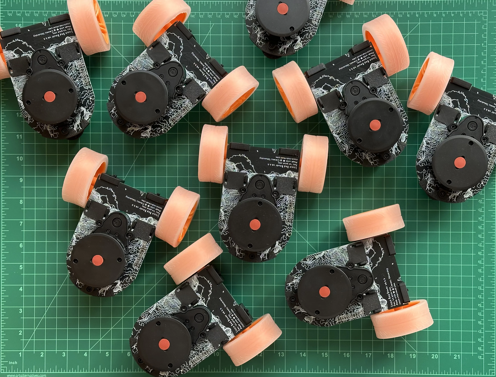

# Little Red Docs

Welcome to the documentation for the Little Red Rover robotics platform.

Little Red Rover is in development, and is not ready for use.
This version of the documentation is written for a user study being conducted at Cornell University, and should not be considered stable or comprehensive.

If you are interested in the project, check out the [GitHub organization](https://github.com/little-red-rover) and take a look at the source code:

[Docs](https://github.com/little-red-rover/lrr-docs)

[Template project](https://github.com/little-red-rover/lrr-template-project)

[ROS environment](https://github.com/little-red-rover/lrr-ros)

[Firmware](https://github.com/little-red-rover/lrr-firmware)

[Hardware](https://github.com/little-red-rover/lrr-hardware)
