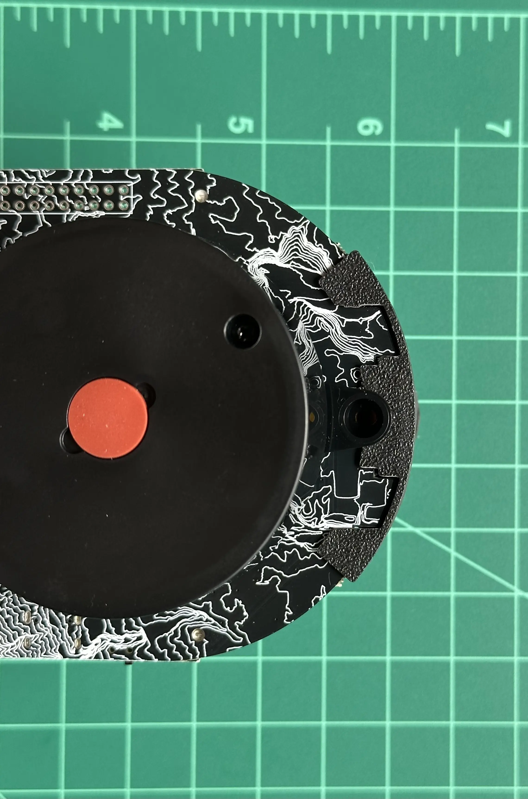

# Kit Assembly

This tutorial will guide you through assembling your rover. It should take around 15 minutes.

## Bill Of Materials

First, make sure your kit has all the required materials.

In the box:

| Item | Quantity | Picture |
| ---- | ---- | ---- |
| Circuit board | 1 |  |
| LD-20 lidar  | 1 |  |
| Orange wheels | 2 |  |
| Motor with encoder | 2 |  |
| 18650 LiIon battery, 5000 mah | 1 |  |
| USB-C to C cable | 1 |  |
| Front skid | 1 |  |
| Motor mount | 2 |  |
| Cable bag | 1 |  |
| Small parts bag | 1 |  |

In the cable bag:

| Item | Quantity | Picture |
| ---- | ---- | ---- |
| 4-pin JST GH 1.25mm straight across cable | 1 |  |
| 6-pin JST PH 2.0mm reversed cables | 2 |  |

In the small parts bag:

| Item | Quantity | Picture |
| ---- | ---- | ---- |
| Motor attachment shims | 2 |  |
| Motor spacing shims | 2 |  |
| Wheel spacers | 2 |  |
| M3-8 machine screw | 3 |  |
| M2.5 hex key | 1 |  |

## Motor Subassembly

Insert a motor cable into one of the motors. Note the ridges on the connector, it can only be installed in one orientation.

Take a motor and place it in a motor mount.

Add a motor spacing shim on top of the motor.

Repeat with the other motor, making sure the second assembly is mirrored to the first.

## Body Assembly

At the base of the circuit board, there are cutouts for the motor mount to slot into place.
Insert the circuit board into the gap...

... then guide the other end of the motor mount up through the slots in the PCB.

Place a motor attachment shim over the parts of the motor mount exposed above the board.
Push the attachment shim up and into place, locking the motor into place.
The hole in the attachment shim should line up with the bolt hole in the circuit board.

Repeat with the other motor.

Flip the robot over.
Insert the motor cables into their connectors.

Insert the LiDAR cable into the bottom of the LiDAR.

Place the LiDAR on top of the circuit board, making sure the cable passes through the hole.

Using the provided hex key, attach the LiDAR to the rover's body using the bottom two mounting points.
For now, leave the third screw unattached.

On the back, insert the LiDAR cable into its connector.

On the front of the rover, there are cutouts for attaching the skid.
Line the skid up with the cutouts, and push it on.
Use the final screw to attach the front skid. 

Insert the battery into the back of the rover.
Take note of polarity - the positive side of the battery (the end with a bump) goes towards the left.

Congrats! Your robot is assembled!

## Care for Your Rover

The rover has a USB C port which you can use to charge the battery.
Two red status LEDs, directly below charging port, show the charging status.

The first LED, labeled CHARGING, lights up when the battery is actively being charged.
Once the battery is fully charged, this light will turn off.

The second LED, labeled PWR GOOD, lights up when a valid power supply is attached.

> [!WARNING]
> **Never charge Little Red Rover unattended.**
>
> If something goes wrong during the charging process, lithium batteries, like the one contained in the rover, are a serious fire hazard. If the battery becomes hot, smokes, swells, or gives off an odor during charging, immediately stop charging and dispose of the battery safely.

## Next Steps

Now that you have an assembled robot, head over to the [software setup](/software_installation) page to get the robot moving around!
