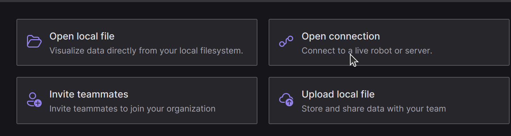
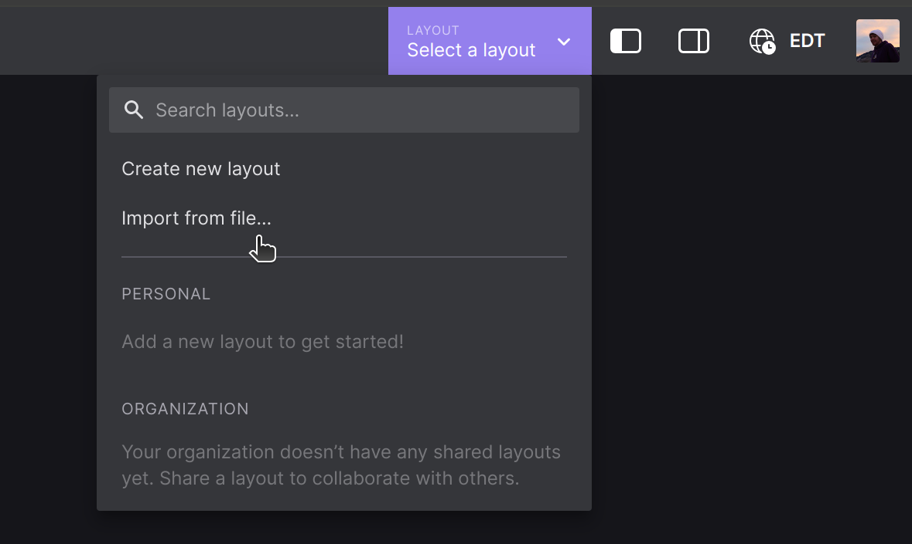
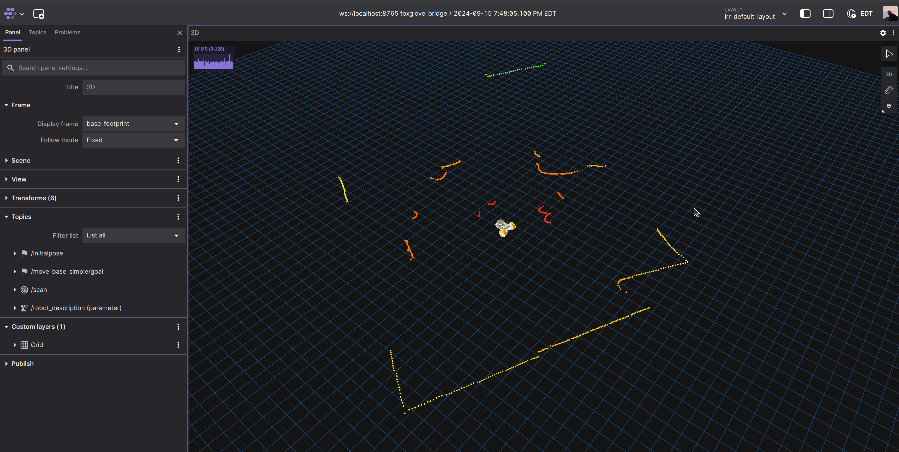
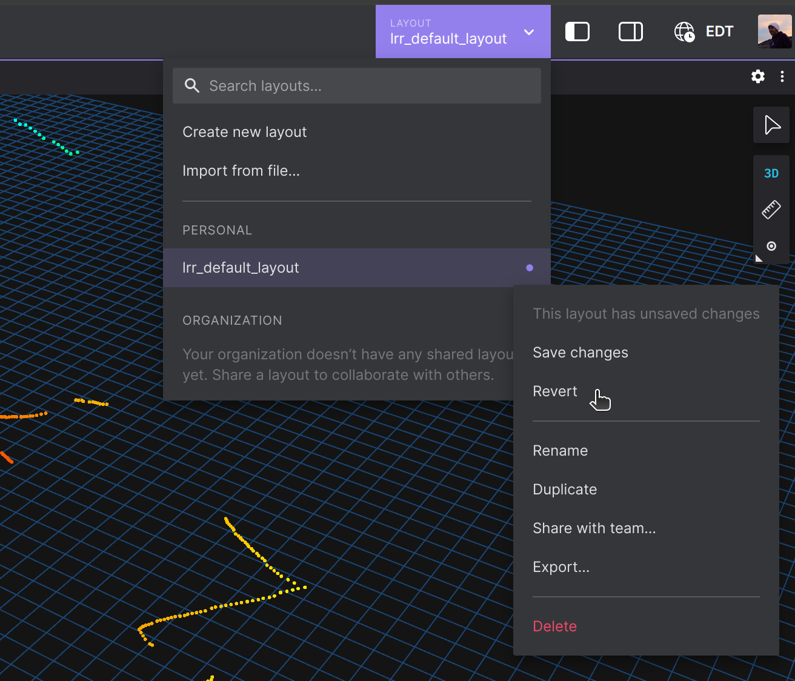

# Software Installation

This tutorial will take you through the first time software setup for your rover. It will require 15 minutes of active time and 45 minutes for downloading / building.

## Dependencies

Little Red Rover relies on several pieces of software that must be installed prior to working with the robot.

### Docker

Little Red Rover uses Docker as a compatibility layer with your host operating system.

<!-- tabs:start -->

#### **Windows**

Follow the [installation instructions](https://docs.docker.com/desktop/install/windows-install/) from the Docker website.

#### **MacOS**

Follow the [installation instructions](https://docs.docker.com/desktop/install/mac-install/) from the Docker website.

#### **Linux**

Follow the [installation instructions](https://docs.docker.com/desktop/install/linux-install/) from the Docker website.
<!-- tabs:end -->

### VSCode

To make working with Docker painless, it's recommended to use the devcontainers feature of the VSCode. First, download VSCode if you don't have it installed already.

<!-- tabs:start -->

#### **Windows**

Follow the [installation instructions](https://code.visualstudio.com/download) from the VSCode website.

#### **MacOS**

Follow the [installation instructions](https://code.visualstudio.com/download) from the VSCode website.

#### **Linux**

Follow the [installation instructions](https://code.visualstudio.com/download) from the VSCode website.

<!-- tabs:end -->

Next, install the devcontainers extension [using the instructions here](https://marketplace.visualstudio.com/items?itemName=ms-vscode-remote.remote-containers).

### Git

Lastly, the project uses Git for source code management. 

<!-- tabs:start -->

#### **Windows**

Follow the [installation instructions](https://git-scm.com/book/en/v2/Getting-Started-Installing-Git) from the Git website.

#### **MacOS**

Follow the [installation instructions](https://git-scm.com/book/en/v2/Getting-Started-Installing-Git) from the Git website.

#### **Linux**

Follow the [installation instructions](https://git-scm.com/book/en/v2/Getting-Started-Installing-Git) from the Git website.

<!-- tabs:end -->

> [!INFO]
> As of now, cloning over https is not supported.
> If you haven't already, please [follow the instructions](https://docs.github.com/en/authentication/connecting-to-github-with-ssh/adding-a-new-ssh-key-to-your-github-account?platform=windows) for adding an SSH key to your GitHub account.


## Setting Up Your Development Environment

Open VSCode, then open a folder where you'd like to store the project (File -> Open Folder).
Start a new terminal (Terminal -> New Terminal) and run the following command to pull a template project:

<!-- tabs:start -->

#### **Hardware Beta Testers**

```bash
git clone --recurse-submodules git@github.com:empriselab/lrr-fa24-beta.git
```

#### **ROS2: Humble (Recommended)**

```bash
git clone --recurse-submodules git@github.com:little-red-rover/lrr-template-project.git
```

#### **ROS1: Noetic**

```bash
git clone --recurse-submodules git@github.com:little-red-rover/lrr-template-project.git && cd lrr-template-project && checkout noetic
```

<!-- tabs:end -->

> [!TIP]
> ROS1 is nearing end of life. For new projects, it is highly recommended to use the most recent long term support (LTS) ROS2 distribution.

Next, open the project in VSCode (File → Open Folder → (chose the folder you just cloned)) and start the devcontainer (View → Command Palate → (type) "Rebuild and Reopen in Container").

> [!INFO]
> Mac and Windows users, Docker Desktop must be started before opening the container.

The first time building the container will take some time (30+ minutes). This only has to happen once, in the future it will be much quicker.

You should now have an open VSCode window running the development container. 

## Connecting to the Robot

Power on your rover using the switch on the left side (near the USB port).
You'll know it's turned on when the LiDAR on top starts spinning.
On boot up, the robot creates a Wi-Fi hotspot. Connect your development computer to the network named `little_red_rover_xx:xx:xx`, where `xx:xx:xx` is a hexadecimal string unique to your rover.

Open a terminal in your VSCode window (Terminal → New Terminal) and enter the following command.

```bash
lrr_connect
```

Follow the instructions in the terminal to connect the robot to a Wi-Fi network.

> [!INFO]
> **Common network pitfalls**
>
> * If you're connecting to a network without a password, leave the passphrase blank and hit enter.
> * As of now, Little Red Rover doesn't support authentication with networks that require a username (notably eduroam, used at universities across the world).
>   - If your network requires a username, the host will most likely provide a seperate network for IOT devices. Use that network. 
>   - If you can't find a suitable network, ask your university's IT department how they recommend connecting an IOT device.
> * If your network has a captive portal, you'll be able to authenticate through the web browser on your computer.
>   While connected to the rovers Wi-Fi network, open [this link](http://example.com). You'll be redirected to the login page.

> [!TIP]
> Connect to the wrong network? You can restart the connection process by holding the button labeled RP and restarting your robot. RP is short for re-provision, a term for connecting IOT devices to the network.

Once you connect your robot to Wi-Fi, you should be able to browse the internet on your computer while connected to the robot's network. Your rover is acting as a router, and you're accessing the internet through it.
Whenever you use your rover, stay connected to its Wi-Fi network. This is how ROS (running on your computer) communicates with the rover.


> [!WARNING]
> You'll need to reconnect your rover to Wi-Fi each time you move to a new location. You'll know the rover needs to be reconnected when the `NETWORKING` status LED turns yellow on power-on.

## Run Teleop

In your VSCode terminal, run

```bash
lrr_run
```

> [!INFO]
> **What's going on here?**
>
> Astute readers may notice that this is not a ROS command, yet it executes `roslaunch` to start the teleop nodes. This is known as an *alias*, or a console command that has been defined to execute some other command. To see what this alias is actually doing, run
>
> ```alias lrr_run```
>
> If you're curious, you can also try
>
> ```alias lrr_connect```
>
>
> ```alias lrr_install```
>
>
> ```alias lrr_build```
>

## Setup Foxglove

Foxglove is a tool we use for visualizing and controlling the rover.
[Create an account on Foxglove](https://app.foxglove.dev/), then select "Open Connection".



In the following popup, leave 'Foxglove Websocket' selected the default value of 'ws://localhost:8765' for the URL. Click 'Open'.


In the top right corner, find the button that says 'Layout'. In the drop-down, select 'Import From File...' then navigate to `(template project installation path)/tools/lrr_default_layout.json`.



> [!TIP]
> Beta students, the layout file will be in the folder for each homework.

If all went well, you should see something like the following:



In the center is a model of the rover. The colorful dots are a laser scan from the LiDAR.
Try picking up the rover and moving it around, you should see the LiDAR readings change in real time.

> [!WARNING]
> If LiDAR data doesn't appear, the robot is probably having trouble communicating with your computer.
> Little Red Rover uses TCP port 8001, make sure this port is allowed through your firewall.
> Instructions vary with operating system, try googling "allow TCP port through firewall".

Now is a great chance to play around with Foxglove.
Add some panels, change some settings, plot some values, see what you can do.
If you mess something up and want to return to the original layout, just click revert:



## Let's Get Rolling!

Time to get the rover driving around!
Before you continue, place your rover on the ground and away from people.

Back in VSCode, you should still have `lrr_run` running in one terminal.
Open a second terminal (the plus sign in the upper right of the terminal window) and run the following command.
Follow the instructions in the terminal to control your rover.

<!-- tabs:start -->

#### **Hardware Beta Testers**

```bash
rosrun teleop_twist_keyboard teleop_twist_keyboard.py _speed:=0.2 _turn:=2.0 _key_timeout:=0.6
```

#### **ROS2: Humble (Recommended)**

Coming soon...

#### **ROS1: Noetic**

```bash
rosrun teleop_twist_keyboard teleop_twist_keyboard.py _speed:=0.2 _turn:=2.0 _key_timeout:=0.6
```

<!-- tabs:end -->

> [!INFO]
> **What's going on here?**
>
> This command runs a node that converts key presses into a [ROS Twist message](https://docs.ros.org/en/melodic/api/geometry_msgs/html/msg/Twist.html). This message it published on the topic `/cmd_vel`, where the rover is subscribed for teleop commands. In a third terminal, try running this command to see what the node is outputting:
> 
> ```rostopic echo /cmd_vel``` 
>
> Several parameters are passed, adjusting the linear and angular speeds to be appropriate for the robot. We also pass the `_key_timeout` parameter, which makes the rover stop whenever you let go of the keys.

> [!TIP]
> To speed things up, try tweaking the parameters in the command.
> Little Red Rover can go *much* faster than what I've started you out with.

After playing around a bit, you may find the controls a bit clunky.
Worry not! We'll fix this in the next tutorial, and even cover how to use a controller.

## Troubleshooting

Check out the [troubleshooting page](/troubleshooting).

