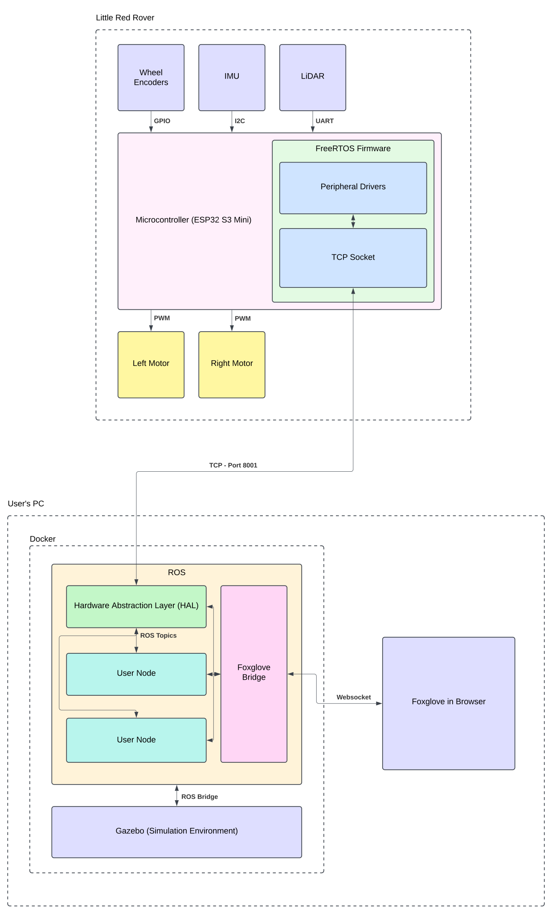

# System Overview

## Design motivation

ROS enabled robots are expensive. Like $800 just to dip your toes in the water expensive. This prevents many aspiring engineers from ever working with ROS. It doesn't have to be this way.

Little Red Rover is designed to be the first truly affordable ROS enabled robot for education.
In order of priority, Little Red Rover's goal is to be:

1. Less expensive than a textbook (nominally $100 - $150).
2. Reliable enough to use in classrooms of 200+ students.
3. Capable enough to use in interesting assignments for a college level robotics course.

Some non-goals of the project are:

1. Using high end, research grade components (conflicts with priority #1)
2. Be highly extensible (conflicts with priority #2, and in some ways #1)

In other words, Little Red Rover is your starter car for ROS.
It not as fast as other cars, but its affordable, safe, and reliable.
Once you've learned enough to know what you want in your next robot, you'll be prepared and educated enough to go and buy it.

These core priorities impacted every design decision that went into the rover.

## Comparison to other systems

How is Little Red Rover different from other ROS enabled systems?
Little Red Rover focuses on doing more with less.

### The status quo

Existing robots are build around single board computers (SBCs) like the Raspberry Pi series or NVIDA Jetson.
These SBCs run Linux and ROS onboard the robot.
This is great if you want a fully self-contained robot, but it does come with some downsides.

The first is cost.
Getting a Raspberry Pi this isn't so bad, costing just $35 at the time of writing.
But if you want something with more kick, you'll have to open your checkbook.
The Jetson lineup will run you anywhere from $250 all the way up to $2000 depending on your requirements.

The second is performance.
SBCs are fundamentally limited by their size, and further kneecapped by the low power requirements of a small mobile robot.
You're not going to be seeing anything close to a laptop or desktop computers' performance without seriously breaking the bank.

### What Little Red Rover does differently

Unlike existing robots, LRR does not include a single board computer.
Instead, it uses a low-cost microcontroller to communicate wirelessly with a base station.
This base station can be any computer you already own, running any operating system.

The flow looks like this:
1. The rover sends sensor information to the base station.
2. The base station uses the data to compute commands.
3. Commands are sent back to the rover.
4. The rover executes the commands.
5. Repeat

### Pros and cons

When compared to other robots, Little Red Rover lack the ability to operate independently of the base station.
In return, it gains computational performance and saves on cost.
In an educational setting, we feel this trade off is a no-brainer.
Educational robots are meant to be worked with interactively and observed, not to operate unsupervised.

## System breakdown

Little Red Rover consists of four subsystems:
1. Hardware
    * The physical components that make up the rover.
2. Firmware
    * The software the runs on the microcontroller onboard the rover.
3. ROS Drivers
    * ROS code that facilitates communication between the host computer and the rover. 
4. Tooling
    * Tools supporting cross-platform usage of the Rover.

How the hardware, firmware, and ROS communicate is described by their interconnects:
1. Hardware to firmware interconnect
    * How firmware reads data from the hardware and sends commands to the actuators.
2. Firmware to ROS interconnect
    * How data from the robot gets transmitted to the host computer's ROS instance.

The following system diagram gives a high level overview of the system.
For further details, consult each subsystem's page.

